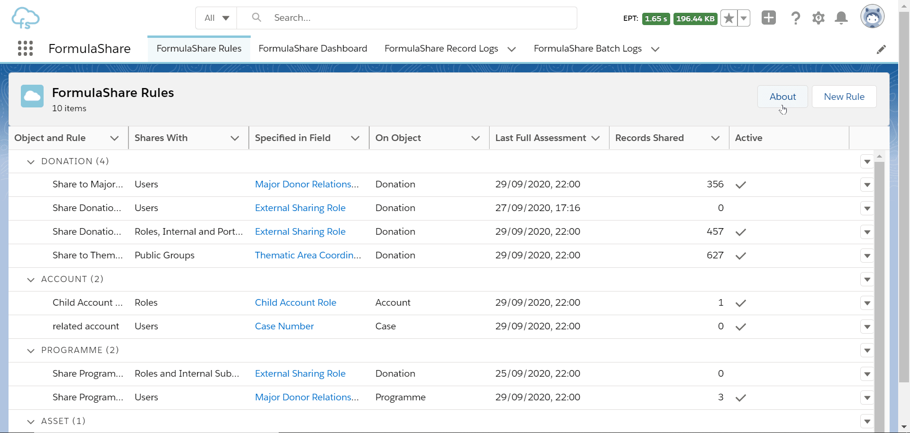
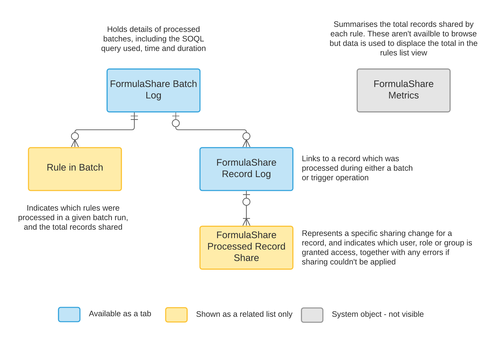

# FormulaShare, apex sharing for admins

**Note**: FormulaShare is published as a free managed package on the AppExchange https://appexchange.salesforce.com/appxListingDetail?listingId=a0N3A00000FR5TCUA1. As of November 2020, the package is installed and active in 49 Enterprise, Unlimited and Professional production orgs (excludes sandboxes and developer edition orgs).

Click-and-configure rules to share records based on related data. Salesforce provides great in-platform options for sharing records - ownership based, criteria based, manual sharing and apex sharing, but there's a key feature missing - sharing to users identified through related data.

FormulaShare let's you do that and more without resorting to complex development.

* Records are shared to a user, role or group specified in a formula, lookup or text field on either the record itself, or a record related by a lookup relationship
* Sharing changes are assessed in real time where possible (this is done by calling FormulaShare from trigger handlers)
* A regular batch applies all sharing changes which result from changes not supported in real time processing
* Standard and custom objects are supported
* Setup and management is done through a custom app available in Classic and Lightning
* Rules are custom metadata, so can be managed by admins and packaged for deployment
* Log records are created for monitoring and reporting (these are subsequently purged within customisable retention periods)
* Powered by Salesforce apex / managed sharing

## Example applications

* In a recruitment system, share job records and applications to the relevant hiring manager user
* In a global org, share records to the relevant roles specified on a linked custom country object
* Share cases to account executive teams, but only when these are not flagged as containing sensitive data
* Share records to all users with the same role as the record owner
* Share accounts and their related records to the public groups specified on related opportunities
* Conditionally share records based on the value in a lookup or formula field (field types not available in standard sharing rules)
* Provide a user lookup field on a record to support ad hoc sharing to colleagues collaborating on a record

## How does it work?

By leveraging standard formula fields, FormulaShare lets admins quickly specify how records should be shared using a familiar feature. Complex relationships and conditions can be set where needed. Rules in custom metadata point FormulaShare to the relevant fields and objects.

Once established, the rule will recalculate relevant sharing in real time when possible, and catch up on any other changes with scheduled batch jobs. Full details of when this sharing will and won't apply are outlined here: https://cloudsundial.com/rule-types-and-application

#### Sharing based on information in a parent record

Suppose a custom object (representing a country, for example) and another custom object (say a job opportunity for that country) are related through a lookup. If we want the to make sure users, roles or groups specified on the country have access to related job opportunities, that's not possible with out of the box Salesforce functionality.

With FormulaShare, we can set a rule to reference a formula field on the job opportunity which specifies who the record should be shared with. The field can be a formula populating with a user, role or a group which is indicated on the country.

Formula fields enable referencing parents or grandparent objects of object A - up to 5 levels are supported.

#### Sharing based on information in a child record

FormulaShare also includes the option to share based on the field values in related records. In our scenario, imagine job opportunities are managed by several named members of a recruitment team. The recruitment team can be represented as a junction object with one lookup to job opportunity, and a second lookup to user, to link each person requiring access. For this setup, we can use a rule specifying a related object to share job opportunities to all members of the recruitment team specified on the junction object records.

## Design approach

Apex sharing is notoriously difficult to implement well - FormulaShare processes the core scenarios where real time recalculation is needed (for example creation of records and changes to formula field values), and handles all other changes which in a catch-up batch job (this includes changes to parent objects referenced in the formula field).

The batch job is scheduled to assess all record sharing on a regular basis. Real time assessment of sharing if needed is called from apex triggers - just 3 lines of code need to be added to a trigger or handler class.

## Technical configuration

Unless there's a good reason not to, we recommend installing the free security reviewed [AppEchange package](https://appexchange.salesforce.com/appxListingDetail?listingId=a0N3A00000FR5TCUA1) to implement FormulaShare. This ensures you can benefit from additional platform limits and automatic package upgrades. For more details on post-installation setup [check the guide](https://cloudsundial.com/node/40).

The steps below outline how to implement when code in this repo is added directly to an org.

* **Assign permissions** Assign the permission set FormulaShare Admin
* **Call FormulaShareService from shared object triggers** The following code can be added to any trigger or trigger handler code called during the after insert, update, delete and undelete invocations of a trigger to manage sharing changes for this object:
```
sdfs.FormulaShareHelper helper = new FormulaShareHelper();
insert helper.getSharesToInsert();
delete helper.getSharesToDelete();
```
If you use a trigger framework with a central delegating handler, the code can be added in a central delegating class instead of individually for each object.

* **Schedule batch recalculation of FormulaShare rules** [Schedule the apex class](https://help.salesforce.com/articleView?id=code_schedule_batch_apex.htm&type=5) FormulaShareProcessSchedulable to recalculate all rules on a regular basis

## Setting up a FormulaShare rule

The following steps can be carried out by an admin when a new sharing requirement is identified:

### Create sharing field
A custom field is needed on the object which should be shared. For rules sharing with users, the field should contain the Id of the user who should be granted access to the record (either 15 or 18 character versions are fine). For rules sharing with groups, the field should contain the name (developer name) of the public group which should be given access. For rules sharing with roles or roles and subordinates, either the Id or name of the role can be used. The field could be a formula returning text with the Id or name, but could alternatively be a lookup field or a text field populated through automation.

### Create sharing reason (custom objects only)
FormulaShare creates entries in the object's share table with a sharing reason, which ensures FormulaShare can keep track of everything shared by a rule and remove sharing which isn't required. Set up a sharing reason (Classic interface only) from the custom object's setup page in the section "Apex Sharing Reasons". Note that if using the Lightning interface, sharing reasons can be set up by temporarily switching to Salesforce Classic.

For standard objects, sharing reasons aren't available. As an alternative, FormulaShare provides options to process rules either as additive (so object sharing is not removed if data conditions change), or fully managed (meaning FormulaShare assumes all records in the object's share table are provided by the configured rule and removes sharing which doesn't meet the criteria of the rule).

### Create FormulaShare rule record
Rules are set up from the FormulaShare Rules tab of the FormulaShare app.



For full details around what can be set here, check the [online guide](https://cloudsundial.com/formulashare-creating-a-rule).

### Test configuration

Create a record in the shared object. As a system admin, the easiest way to check that the sharing is set up is to use the "Sharing" button from the record detail page (Classic interface only). The summary should include a share record for the user, role, role and subordinates or public group which is linked through the shared to field.

### Logs and monitoring

[Logging objects](https://cloudsundial.com/formulashare-monitoring) are used to capture information relevant to successful processing and any errors or warnings, and the summary of logs is represented on the FormulaShare Dashboard tab of the Lightning app. The data structure used for logs is below:



Logs are removed based on a retention schedule, which by default is 8 days for Record Logs and 365 days for Batch Logs. These parameters can be changed, or logging disabled, using a [FormulaShare Settings override](https://cloudsundial.com/formulashare-settings-overrides).

### Limitations

Known limitations are outlined in the guide: https://cloudsundial.com/formulashare-limits-and-limitations

## Ethos

FormulaShare is developed as a community project and is free to use and distribute. Contributions, collaborations, feedback and suggestions are welcome.